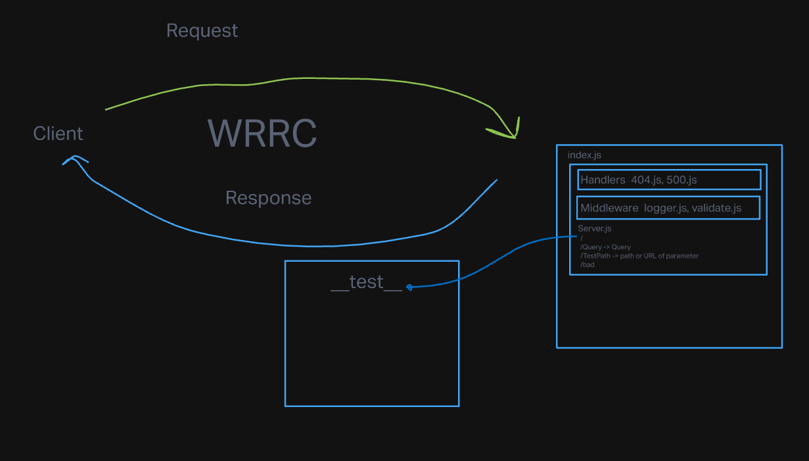

# Basic-Express-Server

## Project: Basic Express Server

## Author: Zoe Gonzalez

### Problem Domain: This application exists for the purpose of practicing deployment of server more in depth than I did in 301. This also expands by adding an additional path way by adding a test for a query and name. It functions very similarily to the server.js test and it is very concise.

GitHub Actions: https://github.com/ZuSolaris/basic-express-server/actions/new

Production Deployment: https://basic-express-production.onrender.com/

### Setup

#### env requirements

see `.env.sample`

PORT: 3001 

### How to initalize application

'npm start'

'nodemon'

'npm test'

#### How to use your library

-nodemon for starting

-npm test for testing

#### Features / Routes

/ : automatically redirects you to the page.

/bad: Sends you to an error page.

/

/person: Sends you to a person with the selected name. 

/* : If the page is not available then an error flag is thrown. 

